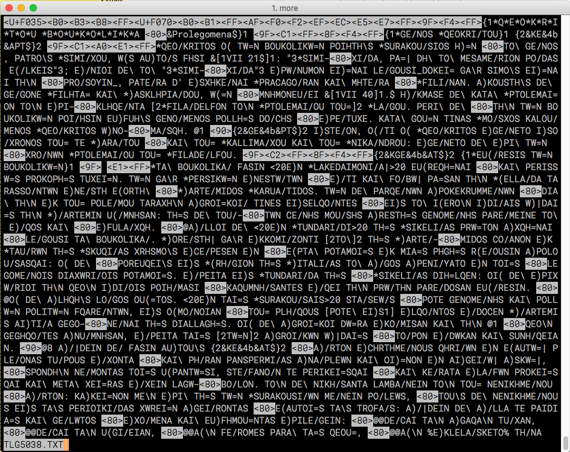
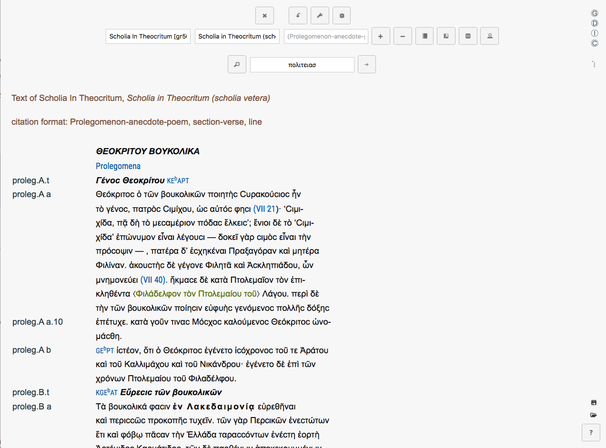
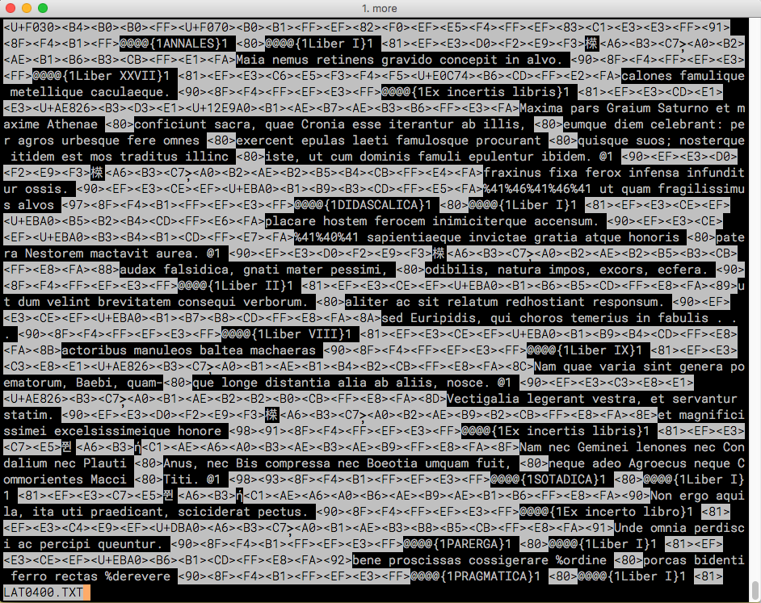
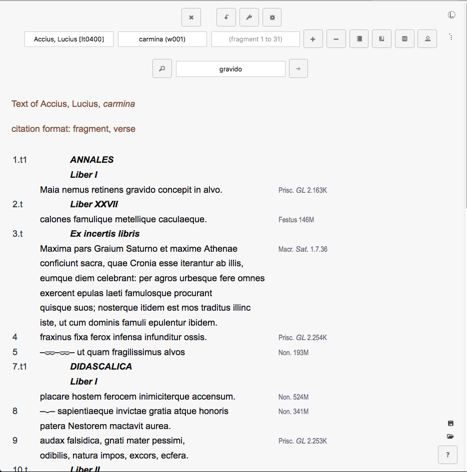
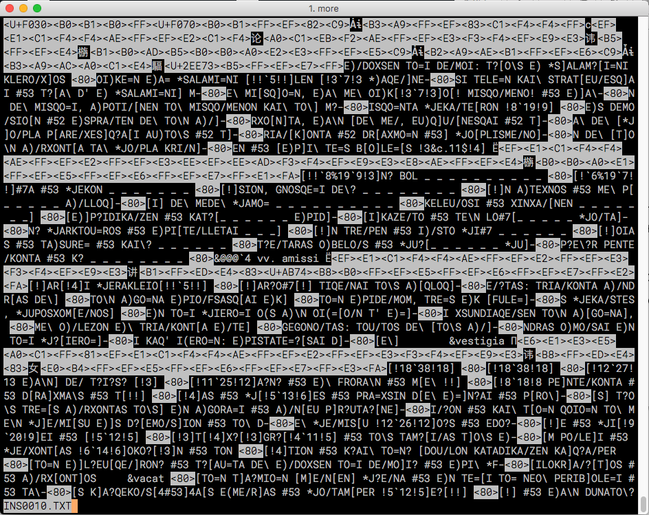
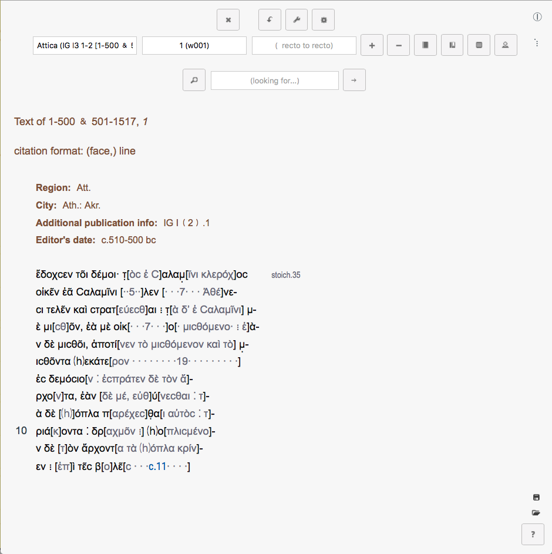

# HipparchiaBuilder

convert greek and latin data files into a searchable database

```

Five databases possible:
    Greek [6625 works]
    Latin [836 works]
    Papyri [49235 works]
    Inscriptions I (earlier and Greeker) [139970 works]
    Inscriptions II (later and more Westerly) [40174 works]

```

these databases can be read by HipparchiaServer

in order to prepare the build environment you need to have installed it via HipparchiaYOUROSTYPE

in addition to the build environment itself, you will need: the `data` to insert into the builder:

```
    the TLG_E and/or PHI00005 and/or PHI7 files (presumably from cd-rom disks)
        your config file will need to point to this data properly

    the lexical data 
        see HipparchiaBSD on how to acquire the lexical data
        [00_FreeBSD_initial_setup.txt or 01_macOS_hipparchia_installation.txt under 'ACQUIRING THE LEXICA']
```

After `config.ini` has been properly edited you can run `makecorpora.py`. A default installation will 
be pre-configured to build all of the databases on the first run.

Little or no little editing of `config.ini` is required to get a working build. You can get away with zero 
edits if you position the raw data in the default locations (i.e., in subfolders under `../HipparchiaData/`. 
Otherwise you have to make sure that `phi`, `tlg`, `...` inside of `config.ini`
all point to the locations where you have staged the data.

If you do not know where/how to find `../HipparchiaData/latin/` or `/Volumes/PHI0005`, you might have problems.
You will need to learn the basics of how to read and edit file path names so that you know where to put things. 

To build, you just call the `makecorpora.py` script. 

```
    % cd ~/hipparchia_venv/HipparchiaBuilder/
    % ./makecorpora.py
    
    or
    
    % ./makecorpora.py -h
```

`HipparchiaServer` knows what it does and does not know: any combination of core data is acceptable, but unusual
combinations of data can be expected to produce unusual results (e.g., only Greek Documentary papyri and the Latin
lexicon and no Latin grammar): some items are more or less meant to go together. But it is possible to install
just a subset of one corpus: only Homer, for example.

minimum software requirements:
```
    python 3.6
    postgresql 9.6+
```

hardware recommendations:
```
	a multicore processor
	2G of RAM can accommodate as many as 12 workers UNTIL you do the word counts
	word counts can fill 16G or RAM very fast: wordcounter() is capped at 4 workers (and will use over 12GB)
	SSD with 15G spare space: 12G for the output and 3G for the input.
	[du -h -d 0 inside of /usr/local/var/postgres outputs '12G']

	minimum requirements are not presently known, but 512MB of RAM is probably required to run HipparchiaServer with 1 thread

```

sample input and output:

TLG:




LAT:




INS:


